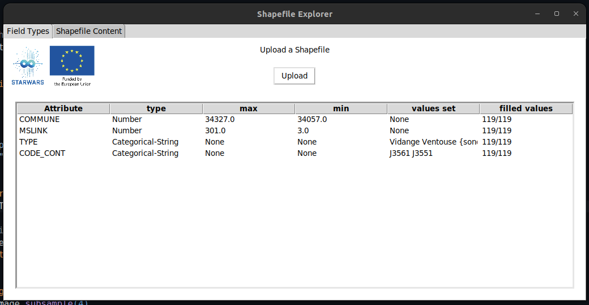
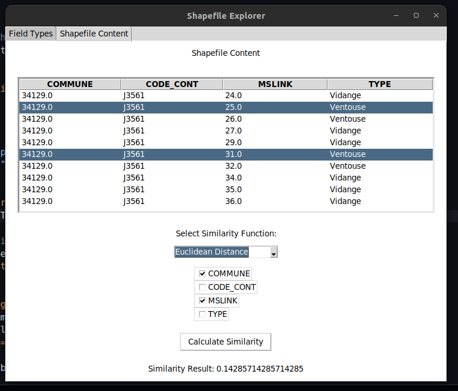

<center> </center>

# A set of tools for Shapefiles exploration and similarity measures

This repository contains a set of tools to analyze the data in GIS ShapeFiles. The tools are based on the [geopandas](https://geopandas.org/) library. The tools allow you to explore the attributes of a shapefile, plot the shapefile, and extract the data from the shapefile, working with similarities ...

## ShapeFile explorer

This is a simple tool to explore the attributes of a shapefile. It allows you to select a shapefile from your local machine and get the attributes of the shapefile as a table, their types, and the values set for each attribute, max, and min values, as well as the number of filled values.

### How to use it

1. Select the shapefile from your local machine.

    ```python
    from ShpExplorer import ShpExplorer

    explo = ShpExplorer()

    explo.field_types(shapefile="path/file.shp")
    ```

2. The tool will display the attributes of the shapefile as a table.

    | type              | max                | min                | values set | filled values |
    |-------------------|--------------------|--------------------|------------|---------------|
    | COMMUNE           | Number             | 34327.0            | 34057.0    | 119/119       |
    | MSLINK            | Number             | 301.0              | 3.0        | 119/119       |
    | TYPE              | Categorical-String | None               | [Vidange, Ventouse, sonde US, Vanne, debitmetr...] | 105/119 |
    | CODE_CONT         | Categorical-String | None               | [J3561, J3551] | 119/119     |



## Similarity Measures

This is a tool to calculate the similarity between two vectors. It uses basic similarity measures like Euclidean, Manhattan, Cosine, and Jaccard similarity. Additionally, it includes advanced similarity measures, especially for mixed data types, when the data contains both numerical and categorical data and frequency-based similarity measures.



### How to use it

1. Select the two vectors you want to compare.
2. Choose the similarity measure you want to use.
3. The tool will calculate and display the similarity between the two vectors.

You can customize the similarity measures according to your needs, whether working with numerical data, categorical data, or a mix of both.

This set of tools is designed to make it easy to work with GIS ShapeFiles and analyze the data they contain, providing a user-friendly interface and powerful analysis capabilities.
